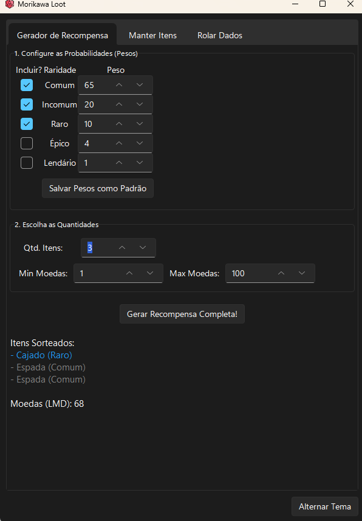

# Morikawa Loot Generator


Uma ferramenta de desktop completa e intuitiva para Mestres de RPG, projetada para agilizar a criação de recompensas e a rolagem de dados. Crie, gerencie e sorteie itens com facilidade, mantendo o foco na sua história.



---

## 🚀 Novidades da Versão 2.0

### ✨ **Atributos Dinâmicos para Itens**
- **Cores Aleatórias:** Adicione cores automáticas aos itens (Vermelho, Azul, Verde, etc.)
- **Sistema de Encantamentos:** Configure a chance de itens receberem encantamentos especiais (Elétrico, Fogo, Gelo, Arcano, etc.)
- **Qualidades do Item:** Sistema completo de condições com pesos configuráveis:
  - Condição impecável (+2)
  - Levemente marcado (+1) 
  - Normal (+0)
  - Bem usado (-1)
  - Desgastado (-2)

### 🎯 **Melhorias de Performance e Interface**
- **Interface Responsiva:** Aproveitamento total da tela em todas as abas
- **Performance Otimizada:** Carregamento mais rápido e operações suavizadas
- **Anti-Flickering:** Interface mais estável sem tremulações
- **Tabelas Maiores:** Visualização melhorada dos itens cadastrados
- **Botão Limpar Histórico:** Limpe facilmente todo o histórico de recompensas e rolagens

### 🛠️ **Funcionalidades Avançadas**
- **Itens de Exemplo:** Sistema de carregamento automático de 10 itens para demonstração
- **Configurações Expandidas:** Controle total sobre todos os aspectos da geração
- **Build Otimizado:** Executável mais estável e confiável

---

## Índice
1. [Principais Funcionalidades](#principais-funcionalidades)
2. [Como Instalar e Executar](#como-instalar-e-executar-para-usuários)
3. [Novidades Detalhadas](#novidades-detalhadas)
4. [Guia de Uso Detalhado](#guia-de-uso-detalhado)
    - [Aba: Gerador de Recompensa](#aba-gerador-de-recompensa)
    - [Aba: Manter Itens](#aba-manter-itens)
    - [Aba: Rolar Dados](#aba-rolar-dados)
5. [Entendendo os Arquivos](#entendendo-os-arquivos-do-programa)
6. [Para Desenvolvedores](#para-desenvolvedores)

---

## Principais Funcionalidades

### 🎲 **Sistema de Recompensas Avançado**
- **Gerador de Recompensas Flexível:** Sorteie itens com base em 5 raridades (Comum, Incomum, Raro, Épico, Lendário) com pesos totalmente customizáveis
- **Atributos Dinâmicos:** Adicione cores, encantamentos e qualidades aos itens automaticamente
- **Sistema de Qualidades:** 5 níveis de condição do item com pesos configuráveis
- **Sorteio de Moedas:** Gere quantidades de moedas em intervalos personalizáveis

### 🗂️ **Gerenciamento de Dados**
- **CRUD Completo:** Adicione, edite e exclua itens da sua base de dados visualmente
- **Filtros e Busca:** Encontre rapidamente itens específicos
- **Itens de Exemplo:** Carregue automaticamente 10 itens de demonstração
- **Validação de Dados:** Prevenção de itens duplicados e nomes inválidos

### 🎯 **Interface e Usabilidade**
- **Interface Responsiva:** Aproveitamento total da tela em todas as abas
- **Tema Claro/Escuro:** Alternância fácil entre modos visuais
- **Histórico Inteligente:** Salvamento automático com opção de limpeza
- **Atalhos Otimizados:** Teclas Enter e Delete para agilidade
- **Performance Otimizada:** Carregamento rápido e operações fluidas

### 🎲 **Sistema de Dados**
- **Dados Padrão:** d4, d6, d8, d10, d12, d20, d100
- **Dados Personalizados:** Configure qualquer quantidade de lados
- **Múltiplos Dados:** Role vários dados simultaneamente
- **Histórico de Rolagens:** Log completo com data e hora

---

## 🔥 Novidades Detalhadas

### **Atributos Dinâmicos - A Grande Novidade!**

**⚠️ Importante:** Os atributos dinâmicos (cores, encantamentos e qualidades) são características **visuais e narrativas** que enriquecem a experiência de jogo. Atualmente, eles **não afetam estatísticas** ou são salvos no banco de dados - são gerados dinamicamente a cada sorteio para inspirar sua narrativa.

#### **🎨 Sistema de Cores**
Quando ativado, adiciona cores aleatórias aos itens:
- Vermelho, Azul, Verde, Amarelo, Preto, Branco, Roxo, Laranja, Cinza, Marrom
- **Exemplo:** "Espada Longa Verde (Comum)"

#### **✨ Sistema de Encantamentos**
Configure a chance (0-100%) de itens receberem encantamentos especiais:
- Elétrico, Fogo, Gelo, Arcano, Luz, Maldição, Natural, Sangramento, Veneno
- **Exemplo:** "Escudo de Ferro Azul <Fogo> (Incomum)"

#### **🛡️ Sistema de Qualidades**
Cada item pode ter uma condição que sugere seu estado e valor:
- **Condição impecável (+2):** Item em perfeito estado
- **Levemente marcado (+1):** Pequenos sinais de uso
- **Normal (+0):** Condição padrão
- **Bem usado (-1):** Sinais evidentes de uso
- **Desgastado (-2):** Item em má condição

**Você pode configurar os pesos** de cada qualidade para controlar a frequência de cada condição.

#### **🎯 Como Usar os Atributos na Mesa**
Estes atributos servem como **ganchos narrativos** e **inspiração para roleplay**:
- Uma "Espada Vermelha" pode ter sido forjada com ferro das montanhas de fogo
- Um item "<Elétrico>" pode crepitar com energia quando empunhado
- Uma condição "Desgastada (-2)" pode sugerir um desconto no preço ou necessidade de reparo

---

## Como Instalar e Executar (Para Usuários)

Para usar o programa, não é necessário instalar Python ou qualquer dependência. Basta seguir os passos abaixo:

1.  **Baixe a Versão Mais Recente:**
    * Vá para a seção de **[Releases](https://github.com/joaoCustodio2/Morikawa-Loot-Generator/releases/latest)** deste repositório.
    * Baixe o arquivo `.zip` da versão mais recente (ex: `Morikawa.Loot.v2.0.zip`).

2.  **Descompacte o Arquivo:**
    * Clique com o botão direito no arquivo `.zip` baixado e escolha "Extrair tudo..." ou "Unzip here".
    * Isso criará uma pasta com o nome do programa (ex: `Morikawa Loot`).

3.  **Mantenha os Arquivos Juntos (Importante!):**
    * Dentro da pasta que você extraiu, haverá o executável e outros arquivos. **Todos eles precisam ficar na mesma pasta para que o programa funcione corretamente.** A estrutura será parecida com esta:
        ```
        /Morikawa Loot/
        |
        |-- Morikawa Loot.exe  (O programa principal que você vai abrir)
        |-- loot_geral.csv     (Sua lista de itens!)
        |-- parametros.json    (Seus pesos e configurações salvos)
        |-- historico.json     (Histórico de recompensas)
        |-- icone.ico
        |-- sv_ttk/            (Pasta do tema visual)
        |-- _internal/         (Dependências do executável)
        ```

4.  **Execute o Programa:**
    * Dê um duplo clique no arquivo `Morikawa Loot.exe` para iniciar a aplicação. Pronto!

---

## Guia de Uso Detalhado

### Aba: Gerador de Recompensa
Nesta tela, você pode sortear itens e moedas para seus jogadores.

#### **1. Configure as Probabilidades (Pesos):**
- Marque as caixas de seleção (`Incluir?`) para as raridades que podem aparecer no sorteio
- Ajuste o "Peso" de cada raridade. Um número maior significa que a raridade tem mais chances de ser sorteada
- **Dica:** Pesos relativos funcionam bem (ex: Comum=65, Incomum=20, Raro=10, Épico=4, Lendário=1)

#### **2. Configure os Atributos Dinâmicos:**
- **Adicionar Cor Aleatória:** Ative para que itens ganhem cores aleatórias
- **Chance de Encantamento:** Defina a porcentagem de chance (0-100%) para encantamentos aparecerem
- **Adicionar Qualidade do Item:** Ative para mostrar a condição/estado do item
- **Pesos das Qualidades:** Quando qualidades estão ativas, configure a probabilidade de cada condição

#### **3. Escolha as Quantidades:**
- **Qtd. Itens:** Defina quantos itens serão sorteados (0-20)
- **Gerar Moedas:** Ative e defina o intervalo Min/Max para sorteio de moedas
- **Min/Max Moedas:** Valores do intervalo para geração de moedas (LMD)

#### **4. Gerar e Gerenciar:**
- **🎲 Gerar Recompensa!:** Clique para ver o resultado na caixa de texto abaixo
- **💾 Salvar:** Salva suas configurações como padrão
- **🗑️ Limpar Histórico:** Remove todo o histórico de recompensas e rolagens

**Exemplo de resultado com atributos:**
```
🎁 Itens Sorteados:
⚔️ Espada Longa Verde • Levemente marcado (+1) • <Fogo> • (Comum)
⚔️ Escudo de Ferro Azul • Normal (+0) • (Incomum)
⚔️ Elmo Mágico Vermelho • Desgastado (-2) • <Arcano> • (Raro)

💰 Moedas (LMD): 47
```
### Aba: Manter Itens
Aqui você gerencia sua base de dados de itens com funcionalidades aprimoradas.

#### **🎲 Carregamento Rápido:**
- **Carregar Itens de Exemplo:** Clique para adicionar automaticamente 10 itens de demonstração (espadas, escudos, armaduras, etc.) com diferentes raridades

#### **🔍 Busca e Visualização:**
- **Filtrar por nome:** Digite no campo de busca para encontrar itens específicos rapidamente
- **Lista Expandida:** Tabelas maiores com melhor visualização dos itens
- **Cores por Raridade:** Itens aparecem coloridos conforme sua raridade na lista

#### **✏️ Gerenciamento de Itens:**

-   **Adicionar um Item:**
    1.  Clique no botão "Limpar Campos"
    2.  Digite o nome do novo item (não pode começar com número)
    3.  Selecione a raridade na caixa de seleção
    4.  Clique em "Adicionar Novo" ou pressione a tecla `Enter`
    * **🚀 Dica de agilidade:** Após adicionar um item, a raridade é mantida e o campo "Nome" é focado automaticamente, permitindo adicionar vários itens da mesma raridade em sequência

-   **Editar um Item:**
    1.  Clique no item que deseja editar na lista
    2.  Seus dados aparecerão nos campos abaixo automaticamente  
    3.  Altere o nome e/ou a raridade conforme necessário
    4.  Clique em "Salvar Edição" ou pressione `Enter` no campo de nome

-   **Excluir um Item:**
    1.  Clique no item que deseja remover na lista
    2.  Clique em "Excluir Selecionado" ou pressione a tecla `Delete`
    3.  Confirme a exclusão na janela que aparecerá

#### **⚡ Atalhos e Validações:**
- **Enter:** Adiciona novo item ou salva edição (dependendo do contexto)
- **Delete:** Exclui item selecionado na lista
- **Validação Automática:** Previne itens duplicados e nomes inválidos
- **Ordenação:** Clique nos cabeçalhos das colunas para ordenar a lista

### Aba: Rolar Dados
Sistema completo de rolagem de dados com histórico detalhado.

#### **🎲 Configuração de Rolagem:**
-   **Quantidade:** Defina quantos dados você quer rolar simultaneamente no campo "Rodar"
-   **Dados Padrão:** Clique em qualquer botão (d4, d6, d8, d10, d12, d20, d100) para rolagem rápida
-   **Dado Personalizado:** Digite o número de lados no campo "Lados" e clique em "Rolar!" para dados customizados

#### **📊 Resultados e Histórico:**
- **Resultado Detalhado:** Mostra cada dado rolado individualmente e o total
- **Timestamp:** Cada rolagem inclui data e hora exatas
- **Histórico Persistente:** Todas as rolagens ficam salvas no arquivo `rolagens_log.txt`
- **Limpeza:** Botão para limpar o log da tela e do arquivo

**Exemplo de resultado:**
```
[31/08/2025 14:30] Rolando 3d6: [4, 6, 2] -> Total: 12
[31/08/2025 14:29] Rolando 1d20: [15] -> Total: 15
```

---

## Entendendo os Arquivos do Programa

Ao usar o programa, ele irá ler e criar alguns arquivos na pasta dele. É importante que eles fiquem junto do `.exe`.

### **📁 Arquivos Principais:**
-   **`Morikawa Loot.exe`:** O programa executável principal
-   **`_internal/`:** Pasta contendo todas as dependências do executável (não modificar)
-   **`sv_ttk/`:** Pasta do sistema de temas visuais (necessária para a interface)

### **📊 Arquivos de Dados (Editáveis):**
-   **`loot_geral.csv`:** **Sua base de dados de itens.** Arquivo CSV que você pode abrir no Excel, Google Sheets ou Bloco de Notas para adicionar muitos itens rapidamente. Mantenha sempre as colunas `nome_item` e `raridade`
-   **`parametros.json`:** Salva automaticamente suas configurações:
    - Pesos das raridades
    - Pesos das qualidades
    - Estados dos atributos dinâmicos (cor, encantamento, qualidade)
    - Configurações de moedas
-   **`historico.json`:** Preserva o conteúdo das caixas de resultado entre sessões
-   **`rolagens_log.txt`:** Log permanente de todas as rolagens de dados com timestamps

### **💡 Dicas para Edição Manual:**
- **CSV:** Ideal para importar grandes listas de itens de planilhas
- **JSON:** Pode ser editado para ajustes avançados de configuração
- **Backup:** Recomenda-se fazer backup dos arquivos `.csv` e `.json` antes de grandes mudanças

---

## 📋 Changelog - Versão 2.0

### **🆕 Funcionalidades Adicionadas:**
- ✅ Sistema completo de atributos dinâmicos (cores, encantamentos, qualidades)
- ✅ Configuração de pesos para qualidades de itens
- ✅ Botão "Limpar Histórico" para reset completo
- ✅ Sistema de carregamento de itens de exemplo (10 itens)
- ✅ Interface responsiva com aproveitamento total da tela
- ✅ Validação aprimorada de dados (nomes não podem começar com números)

### **🔧 Melhorias Implementadas:**
- ✅ Performance otimizada em todas as operações
- ✅ Eliminação completa de flickering visual entre abas
- ✅ Tabelas expandidas para melhor visualização
- ✅ Sistema anti-flickering avançado
- ✅ Canvas responsivo com scrolling suavizado
- ✅ Configuração hierárquica de responsividade

### **🐛 Correções de Bugs:**
- ✅ Corrigido problema de aproveitamento de tela
- ✅ Resolvido flickering ao trocar entre abas
- ✅ Melhorada responsividade do canvas principal
- ✅ Otimizada configuração inicial da interface
- ✅ Estabilizado sistema de scroll com mouse wheel

### **⚠️ Limitações Conhecidas:**
- Atributos dinâmicos são gerados por sorteio e não salvos no banco de dados
- Cores e encantamentos servem como inspiração narrativa, não afetam mecânicas
- Qualidades sugerem condições mas não implementam modificadores automáticos

---

## Para Desenvolvedores

Se você deseja executar ou modificar o projeto a partir do código-fonte:

### **📋 Pré-requisitos:**
* [Python 3.8+](https://www.python.org/) instalado
* Git para clonagem do repositório

### **🛠️ Instalação:**
1. Clone este repositório:
   ```bash
   git clone https://github.com/joaoCustodio2/Morikawa-Loot-Generator.git
   cd Morikawa-Loot-Generator
   ```

2. Instale as dependências:
   ```bash
   pip install sv-ttk
   ```

### **▶️ Execução:**
```bash
python main.py
```

### **📦 Gerar Executável:**
1. Instale o PyInstaller:
   ```bash
   pip install pyinstaller
   ```

2. Gere o executável usando o arquivo spec:
   ```bash
   pyinstaller "Morikawa Loot.spec"
   ```

3. O executável será gerado em `dist/Morikawa Loot/`

### **🏗️ Estrutura do Projeto:**
- **`main.py`:** Código principal da aplicação
- **`Morikawa Loot.spec`:** Configuração do PyInstaller
- **`sv_ttk/`:** Biblioteca de temas customizados
- **`icone.ico`:** Ícone da aplicação
- Arquivos de dados são gerados automaticamente na primeira execução

---

## 📞 Suporte e Contribuições

- **🐛 Reportar Bugs:** Abra uma [Issue](https://github.com/joaoCustodio2/Morikawa-Loot-Generator/issues)
- **💡 Sugerir Melhorias:** Use a seção [Discussions](https://github.com/joaoCustodio2/Morikawa-Loot-Generator/discussions)
- **🤝 Contribuir:** Fork o projeto e envie um Pull Request

---

**Desenvolvido com ❤️ para a comunidade de RPG**

*Que seus dados sempre sejam altos e seus loots sempre épicos!* 🎲✨